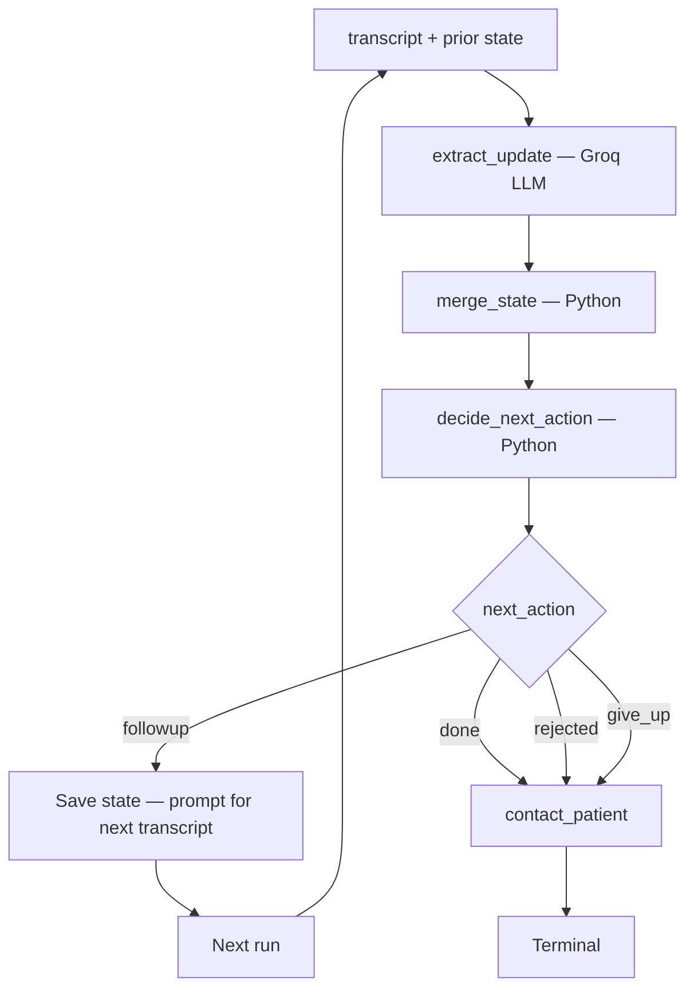

# PCP Coordination Agent

LangGraph workflow that processes PCP office call transcripts for DME order follow-up. One run = one advocate call: extract signals from the transcript, merge into case state, decide the next action, and contact the patient when the case closes.

**Demo case:** Eleanor Martinez — standard manual wheelchair, billing code **K0001**, PCP Dr. Sarah Chen at Sunrise Family Medicine.

See **[WRITE.md](WRITE.md)** for sequencing decisions, architecture rationale, the cut list, and roadmap.

---

## Architecture

Human-in-the-loop: the advocate makes calls off-system and supplies transcripts. The agent interprets and routes — it does not dial the PCP office.



**One LLM call per turn.** All routing rules are deterministic Python — not model output.

| Module | File | Responsibility |
|---|---|---|
| 1 | `pcp_agent/state.py` | Case schema, enums, diff helpers |
| 2 | `pcp_agent/llm_extract.py` | Groq structured extraction → `ExtractDiff` |
| 3 | `pcp_agent/merge.py` | Fold diff into state (status, log, contact counters) |
| 4 | `pcp_agent/rules.py` | `decide_next_action` — pure rule function |
| 5 | `pcp_agent/patient.py` | Patient callback message drafts |
| 6 | `pcp_agent/graph.py` | LangGraph wiring + `MemorySaver` checkpoint |
| 7 | `pcp_agent/run_turn.py` | CLI runner + JSON persistence |

---

## Decision rules

Priority order (first match wins):

| Condition | `next_action` |
|---|---|
| Wrong billing code (`mentioned_code ≠ K0001` or `signal: wrong_code`) | `rejected` |
| Order signed + correct code (`signal: submitted`, code matches) | `done` |
| `followup_count >= 10` without resolution | `give_up` |
| Everything else (acknowledged, stalled, no_answer) | `followup` |

- **`rejected`** — wrong code only. Stalls never auto-reject.
- **`followup`** — single bucket for all pending follow-up.
- **Terminal actions** (`done`, `rejected`, `give_up`) draft a patient callback message.

---

## Setup

**Requirements:** Python 3.13+, [uv](https://github.com/astral-sh/uv) (or pip)

```bash
uv sync
```

Copy environment variables:

```bash
cp .env.example .env
```

Set your Groq API key in `.env`:

```env
GROQ_API_KEY=gsk_your_key_here
GROQ_MODEL=openai/gpt-oss-20b
```

---

## Running a turn

### Single turn

```bash
python -m pcp_agent.run_turn --transcript-file data/fixtures/extract/turn1_initial_outreach.txt
```

State auto-loads from `data/output/eleanor-martinez_state.json` on subsequent runs.

### Interactive loop

Prompts for the next transcript file after each `followup` decision:

```bash
python -m pcp_agent.run_turn --interactive
```

### With explicit prior state

```bash
python -m pcp_agent.run_turn \
  --state-file data/fixtures/extract/prior_states/turn6_prior.json \
  --transcript-file data/fixtures/extract/turn6_wrong_code_k0002.txt
```

### Fresh start

```bash
# Windows
del data\output\eleanor-martinez_state.json

# macOS / Linux
rm data/output/eleanor-martinez_state.json
```

---

## Demo transcript sequence

| Turn | Fixture | Expected decision |
|---|---|---|
| 1 | `data/fixtures/extract/turn1_initial_outreach.txt` | `followup` |
| 2 | `data/fixtures/extract/turn2_order_in_progress.txt` | `followup` |
| 3 | `data/fixtures/extract/turn3_no_answer.txt` | `followup` |
| 4 | `data/fixtures/extract/turn4_still_stalled.txt` | `followup` |
| 5 | `data/fixtures/extract/turn5_confirmed_k0001.txt` | `done` |
| 6 (branch) | `data/fixtures/extract/turn6_wrong_code_k0002.txt` | `rejected` |

Run turns 1–5 sequentially. Turn 6 is a separate branch — use `prior_states/turn6_prior.json`.

```bash
python -m pcp_agent.run_turn --transcript-file data/fixtures/extract/turn1_initial_outreach.txt
python -m pcp_agent.run_turn --transcript-file data/fixtures/extract/turn2_order_in_progress.txt
python -m pcp_agent.run_turn --transcript-file data/fixtures/extract/turn3_no_answer.txt
python -m pcp_agent.run_turn --transcript-file data/fixtures/extract/turn4_still_stalled.txt
python -m pcp_agent.run_turn --transcript-file data/fixtures/extract/turn5_confirmed_k0001.txt
```

---

## Output sections

Each run prints:

```
=== BEFORE STATE ===
--- transcript ---
=== EXTRACT DIFF ===      ← Groq structured output
=== AFTER STATE ===       ← merged case state
=== DECISION ===          ← followup | done | rejected | give_up
=== PATIENT MESSAGE ===   ← only on terminal decisions
```

State is saved to:
- **JSON:** `data/output/{patient_id}_state.json`
- **LangGraph:** `MemorySaver` checkpoint (thread id = `patient_id`)

---

## Testing

### Unit tests (no API key, no network)

```bash
python -m pytest tests/test_pcp_agent_state.py tests/test_pcp_agent_rules.py -v
```

### Manual LLM tests (requires `GROQ_API_KEY`)

```bash
python -m pcp_agent.run_turn --transcript-file data/fixtures/extract/turn1_initial_outreach.txt
```

---

## Project layout

```
pcp_agent/              # agent package (see modules table above)
data/fixtures/extract/  # demo transcripts + prior-state snapshots
data/output/            # auto-saved case state JSON
tests/                  # unit tests for state + rules
README.md               # this file — setup and usage
WRITE.md                # design writeup — sequencing, cuts, roadmap
```
